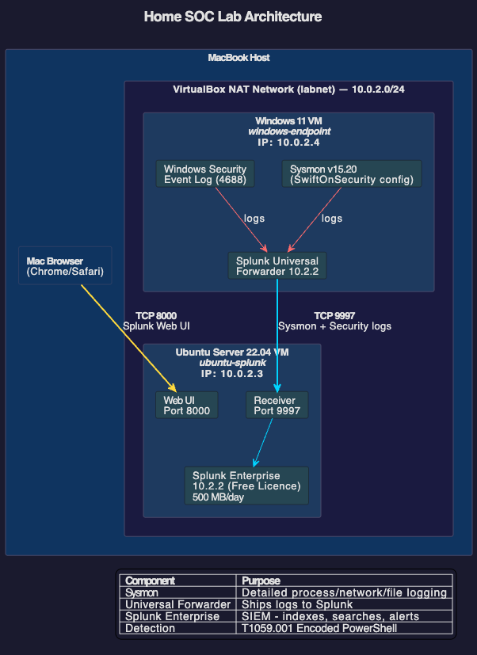

# Home SOC Lab - Splunk + Sysmon

I built a virtualised detection lab on my MacBook using VirtualBox to simulate
a SOC environment. I generate suspicious activity on a Windows endpoint, ship
the logs to Splunk, detect the activity with a custom SPL rule, and walk through
a full PICERL incident response.

## Architecture

- **Windows 11 Enterprise Evaluation (VirtualBox VM)** - my endpoint.
  I installed Sysmon (SwiftOnSecurity config) and the Splunk Universal Forwarder.
- **Ubuntu Server 22.04 (VirtualBox VM)** - my Splunk server running
  Splunk Enterprise (Free licence, 500 MB/day).
- Both VMs run on a VirtualBox NAT Network so they can communicate directly.
- The forwarder ships logs to Splunk on TCP 9997.

## Repo layout
- `/detections/`  - my SPL detection rules with tuning notes
- `/reports/`     - my PICERL incident reports
- `/screenshots/` - evidence: ingestion, detection firing, etc.
- `/diagrams/`    - architecture diagram

## Detections I built
| ID  | MITRE     | Description                             |
|-----|-----------|-----------------------------------------|
| 001 | T1059.001 | Encoded PowerShell execution            |

## What I learned
- I discovered that Windows command-line auditing is off by default. My
  detection returned zero results until I enabled
  `ProcessCreationIncludeCmdLine_Enabled` and the "Process Creation" audit
  subcategory with `auditpol`.
- I learned that SwiftOnSecurity's Sysmon config is a sensible default but
  some detection categories are intentionally tuned out. I now know to read
  the XML before deploying in future environments.
- I found that Splunk Free drops alerting and auth features, so in a real
  SOC I would run Enterprise or an alternative like Elastic or Wazuh. The
  SPL skills I built here transfer directly.
- I ran into significant networking challenges with VirtualBox. Each NAT
  VM is isolated, so I had to switch to a NAT Network to allow VM-to-VM
  traffic. This taught me how important network architecture is even in
  a small lab, and in production a flat network or VLANs would make this
  trivial.
- I learned the full PICERL incident response framework by writing up a
  detection I built and triggered myself, which gave me hands-on experience
  with every phase from preparation through lessons learned.
